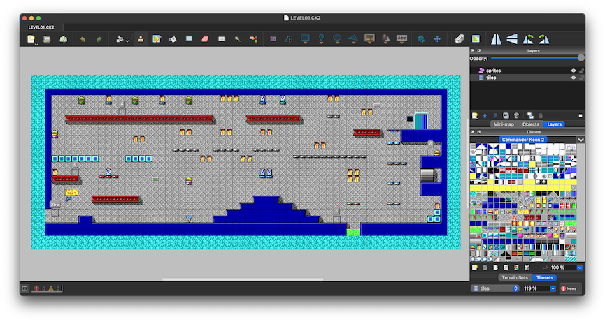

# Commander Keen 1-3 Tiled Map Format Support

Load and save maps from the first 3 Keen games directly in Tiled!

## How to Use

- Go into Tiled Preferences > Plugins, and click the Open... button to pop open your tiled directory.
- Drag `keen-tiled.js`, `keen1.png`, `keen2.png`, and `keen3.png` into the extensions folder.
- Open any `LEVEL**.CK*` file in Tiled! (Hopefully!)

The importer will create two layers, `tiles` and `sprites`. These layers must remain present in the same order, and cannot be modified. Sprites will be snapped to whatever tile the top left corner is in if they aren't exactly on a tile border. Currently, they don't have fancy names, and the number in the "name" field is what will be saved back into the file.